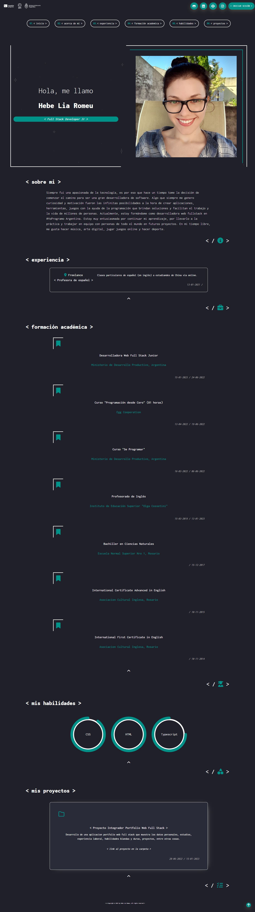

<a id="readme-top"></a>
<!-- PROJECT SHIELDS -->
<!--
I'm using markdown "reference style" links for readability.
 https://www.markdownguide.org/basic-syntax/#reference-style-links
-->

[![Contributors][contributors-shield]][contributors-url]
[![Forks][forks-shield]][forks-url]
[![Stargazers][stars-shield]][stars-url]
[![Issues][issues-shield]][issues-url]
[![MIT License][license-shield]][license-url]
[![LinkedIn][linkedin-shield]][linkedin-url]

<!-- PROJECT LOGO -->
<br />
<div align="center">
  <a href="https://github.com/hebelia/front-end">
      
    
  </a>

<h2 align="center">< Portfolio Web ></h2>

  <p align="center">
    Desarrollo de una aplicacion portfolio web full stack que muestra los datos personales, estudios, experiencia laboral, habilidades blandas y duras y proyectos, permitiendo editar los datos que ya existen y agregar nuevos.
    <br />
    <a href="https://github.com/hebelia/front-end"><strong>:open_file_folder: Explora los documentos »</strong></a>
    <br />
    <br />
    <a href="https://github.com/hebelia/front-end">Ver lanzamiento inicial</a>
    ·
    <a href="https://github.com/hebelia/front-end/issues">Reportar un error</a>
    ·
    <a href="https://github.com/hebelia/front-end/issues">Solicitar función</a>
  </p>
</div>

<!-- TABLE OF CONTENTS -->
<details>
  <summary>Contenidos</summary>
  <ol>
    <li>
      <a href="#sobre">Sobre este proyecto</a>
      <ul>
        <li><a href="#creado-con">Creado con</a></li>
      </ul>
    </li>
    <li><a href="#descripcion">Descripción</a></li>
    <li>
      <a href="#preparacion">Preparación</a>
      <ul>
        <li><a href="#requisitos">Requisitos</a></li>
        <li><a href="#instalacion">Instalación</a></li>
      </ul>
    </li>
    <li><a href="#roadmap">Roadmap</a></li>
    <li><a href="#contribuciones">Contribuciones</a></li>
    <li><a href="#agradecimientos">Agradecimientos</a></li>
    <li><a href="#licencia">Licencia</a></li>
    <li><a href="#contacto">Contacto</a></li>
  </ol>
</details>

<!-- ABOUT THE PROJECT -->
<br /> 
<h1 id="sobre">:memo: Sobre este proyecto:</h1>

Este portfolio es el proyecto integrador de "Argentina Programa: Segunda Etapa #YoProgramo" que tenia como objetivo formar programadxres capaces de desarrollar una aplicación web full stack, que mostrará: tus datos personales, estudios cursados, experiencia laboral, conocimiento de las tecnologías y habilidades que posea. Es decir, crear un portfolio web. Esta aplicación tiene una arquitectura distribuida y contiene un diseño de interfaz de usuario (front end) que muestra la información, una base de datos que almacena la información ingresada y cuenta con las APIs necesarias para proveer a través de internet la información (back end).

<h3 align="center" width="50">


</h3>

Link del back-end del proyecto: [⋄ click aca ⋄](https://github.com/hebelia/back-end)

<!-- gif del proyecto -->

<!-- [![Product Name Screen Shot][product-screenshot]](https://example.com) -->

<p align="right">(<a href="#readme-top"> ▲ </a>)</p>

## Creado con :

<br />

- [![Angular][angular.io]][angular-url]

- [![Bootstrap][bootstrap.com]][bootstrap-url]

- [![GitHub][github.com]][github-url]

  - para el versionado de la aplicación

<p align="right">(<a href="#readme-top"> ▲ </a>)</p>

<!-- DESCRIPTION -->
<h1 id="descripcion">Descripción</h1>

Este portfolio fue el primer proyecto que realice en programación, se trata de un portfolio web SPA(Single Page Aplication), consumiendo una API que cree utilizando Java para poder modificar, agregar, traer y eliminar información de la base de datos.

Link del front-end del proyecto: [⋄ click aca ⋄](https://github.com/hebelia/front-end)

Link del back-end del proyecto: [⋄ click aca ⋄](https://github.com/hebelia/back-end)

Fue un curso completamente auto gestionado seguí la maquetación que fue dada en el curso y pude darle la funcionalidades requeridas, las cuales son:

- <b>< navbar ></b> En esta sección tenemos la barra de navegación, la cual posee el logo de Argentina Programa, las redes sociales (editables en modo administrador), botón de login y botón para el modo nocturno
- <b>< navegación ></b> En esta sección tenemos botones que nos dirigen a las distintas secciones del portfolio
- <b>< introducción ></b> En esta sección tenemos banner, información personal e imagen personal
- <b>< sobre mi ></b> En esta sección tenemos mi información personal más detallada y stack tecnológico manejado hasta el momento
- <b>< formación académica ></b> En esta sección tenemos toda mi información académica
- <b>< esperiencia ></b> En esta sección tenemos toda mi información laboral
- <b>< habilidades ></b> En esta sección tenemos toda la información de las habilidades técnicas y blandas
- <b>< proyectos ></b> En esta sección tenemos toda la información de proyectos realizados por mi
- <b>< footer ></b> En esta sección tenemos la licencia
  <br />

## Imágenes del portfolio web:

<!-- cambiar links a links de imagenes dentro del repositorio y agregar mas -->
<br />
<details>
  <summary> <a> Vista normal :mag_right: </a></summary>



</details>
<details>
  <summary> <a> Vista desde un movil :mag_right:</a></summary>


</details>
<details>
  <summary> <a> Gif - vista normal :mag_right:</a></summary>

</details>
<details>
  <summary> <a> Gif - vista con acceso a edición :mag_right:</a></summary>

</details>
<br />

<p align="right">(<a href="#readme-top"> ▲ </a>)</p>

<!-- GETTING STARTED -->
<h1 id="preparacion">:pushpin: Preparación </h1>

- Estos son las versiones de las tecnologias utilizadas dentro de mi proyecto.

> Angular CLI: 15.0.0
> <br />
> Node: 18.12.1
> <br />
> Package Manager: npm 8.19.2
> <br />
> OS: win32 x64

> Angular: 15.0.0 <br />
> ... animations, cli, common, compiler, compiler-cli, core, forms <br />
> ... platform-browser, platform-browser-dynamic, router

| Package                       | Version  |
| ----------------------------- | -------- |
| @angular-devkit/architect     | 0.1500.0 |
| @angular-devkit/build-angular | 15.0.0   |
| @angular-devkit/core          | 15.0.0   |
| @angular-devkit/schematics    | 15.0.0   |
| @schematics/angular           | 15.0.0   |
| rxjs                          | 7.5.7    |
| typescript                    | 4.8.4    |

Para obtener una copia local en funcionamiento, seguí estos pasos :

<h2 id="requisitos"> <strong>:heavy_check_mark: Requisitos </strong></h2>
<br />

- Instalar el Administrador de paquetes de nodos. Node Package Manager (npm) es un repositorio de software para paquetes de JavaScript. Podes descargarlo [⋄ aca ⋄](https://nodejs.org/es/download/)

- Istalar angular CLI version 15 

    * npm
    ```sh
    $ npm install -g @angular/cli
    ```
<br />

<h2 id="instalacion"> <strong>:heavy_check_mark: Instalación </strong></h2>
<br />

- Clona el proyecto localmente.

  ```sh
  git clone https://github.com/hebelia/front-end.git
  ```

- Instalar paquetes npm.

  ```sh
  npm install
  ```

- Si encuentra algún informe de vulnerabilidad, corríjalo con:
    ```sh
    npm audit fix
    ```

- Abrir el proyecto en un navegador.
  ```sh
  ng serve
  ```

<br />

<p align="right">(<a href="#readme-top"> ▲ </a>)</p>

<!-- ROADMAP -->
<h2 id="roadmap">:bookmark: Roadmap </h2>


<br />:heavy_check_mark: Mostrar información traida desde la base de datos
<br />:heavy_check_mark: Ingresar con usuario/mail y contraseña para poder acceder al modo edición
<br />:heavy_check_mark:Editar la información de las distintas secciones
<br />:heavy_check_mark:Agregar nuevos apartados
<br />:heavy_check_mark:Uso de formularios reactivos
<br />:heavy_check_mark:Verificación de datos
<br />:heavy_check_mark:Eliminar la información
<br />:heavy_check_mark:Botones para redirigir al inicio
<br />:heavy_check_mark:Diseño responsive

### Funciones que planeo agregar en el futuro

- [ ] Toggle light & dark mode
- [ ] Mas funciones de accesibilidad
- [ ] Forma de contacto enviando un mail/mensaje dentro de la página

<p align="right">(<a href="#readme-top"> ▲ </a>)</p>

<!-- CONTRIBUTING -->
<h2 id="contribuciones">:bulb: Contribuciones </h2>

Las contribuciones y sugerencias son lo que hace que la comunidad de código abierto sea un lugar increíble para aprender, inspirar y crear. Al estar comenzando mi camino en la programación cualquier contribución que hagas es **apreciada enormemente** :smile:
<br />
:pushpin: Las sugerencias al repositorio se pueden hacer generando un fork y haciendo un pull request o abriendo simplemente un "issue" con la etiqueta "mejora".

Sugerencias: [⋄ click aca ⋄](https://github.com/hebelia/front-end/issues) ver la lista completa de las características propuestas (y los problemas conocidos).

<p align="right">(<a href="#readme-top"> ▲ </a>)</p>

<!-- ACKNOWLEDGMENTS -->
<h2 id="agradecimientos">:small_blue_diamond: Agradecimientos :small_blue_diamond:</h2>

- 
- [Compañeros de programa TK](https://www.programa.tk)
- [Comunidades de discord]() 


<p align="right">(<a href="#readme-top"> ▲ </a>)</p>

<!-- LICENSE -->
<h2 id="licencia">Licencia :copyright:</h2>

<br />
< Copyright © 2022 by Hebe Lia Romeu, all rights reserved >
<br />
<br />
Ir a `LICENSE.txt` para más información.

<br />
<br />
<!-- CONTACT -->
<h1 align="center" id="contacto">Contacto </h1>

<h3 align="center">Hebe Lia Romeu </h3> <br />

<h3 align="center">

[@hebe.lia](https://instagram.com/hebe.lia)

</h3>
<h3 align="center">
hebeliaromeu@gmail.com
<h3>

<p align="right">(<a href="#readme-top"> ▲ </a>)</p>

<!-- MARKDOWN LINKS & IMAGES -->

[contributors-shield]: https://img.shields.io/github/contributors/hebelia/front-end.svg?style=for-the-badge
[contributors-url]: https://github.com/hebelia/front-end/graphs/contributors
[forks-shield]: https://img.shields.io/github/forks/hebelia/front-end.svg?style=for-the-badge
[forks-url]: https://github.com/hebelia/front-end/network/members
[stars-shield]: https://img.shields.io/github/stars/hebelia/front-end.svg?style=for-the-badge
[stars-url]: https://github.com/hebelia/front-end/stargazers
[issues-shield]: https://img.shields.io/github/issues/hebelia/front-end.svg?style=for-the-badge
[issues-url]: https://github.com/hebelia/front-end/issues
[license-shield]: https://img.shields.io/badge/license-563D7C?style=for-the-badge&logo=C&logoColor=white
[license-url]: https://github.com/hebelia/front-end/blob/master/LICENSE.txt
[linkedin-shield]: https://img.shields.io/badge/-LinkedIn-black.svg?style=for-the-badge&logo=linkedin&colorB=555
[linkedin-url]: https://www.linkedin.com/in/hebe-lia-romeu-0a5343234/

<!--  -->

[github-url]: https://github.com
[github.com]: https://img.shields.io/badge/GitHub-35495E?style=for-the-badge&logo=github&logoColor=4FC08D
[angular.io]: https://img.shields.io/badge/Angular-DD0031?style=for-the-badge&logo=angular&logoColor=white
[angular-url]: https://angular.io/
[bootstrap.com]: https://img.shields.io/badge/Bootstrap-563D7C?style=for-the-badge&logo=bootstrap&logoColor=white
[bootstrap-url]: https://getbootstrap.com

<!--  -->

<!-- IMAGES & MEDIA -->

[product-screenshot]: images/screenshot.png

[portfolio-pc]:
[portfolio-mobile]:
[prtfolio-pc-admin]:
[portfolio-mobile-admin]:
